<div align="center">


# 🌍 ScholarTrack Africa

### The AI platform that gets African students funded.

**51 scholarships · 6 AI tools · Dark mode · Mock interviews · Smart reminders · PWA**

[](https://github.com/Hope0351/scholartrack/releases)
[](LICENSE)
[](https://nextjs.org/)
[](https://www.typescriptlang.org/)
[](https://www.prisma.io/)
[](https://www.npmjs.com/package/z-ai-web-dev-sdk)

**Stop searching. Start matching. Get funded.**

[Download v3.0](https://github.com/Hope0351/scholartrack/releases/tag/v3.0.0) · [Live Preview](#-live-preview) · [Features](#-features) · [Screenshots](#-screenshots) · [Quick Start](#-quick-start)

</div>

---

> ### 💡 The problem
> Every year, **thousands of African students** miss out on life-changing scholarships — not because they aren't qualified, but because they don't know where to look, can't tell if they're eligible, and submit essays that don't stand out.
>
> ### ✅ The solution
> ScholarTrack Africa uses AI to **find the right scholarships for you**, **check if you qualify before you apply**, **coach your essays**, **practice your interviews**, and **track every deadline** — all in one place.

---

## 📑 Table of Contents

- [What's New in v3](#-whats-new-in-v3)
- [Live Preview](#-live-preview)
- [Features](#-features)
- [Screenshots](#-screenshots)
- [Architecture](#-architecture)
- [Tech Stack](#-tech-stack)
- [Quick Start](#-quick-start)
- [AI Design](#-ai-design)
- [Database](#-database)
- [API Reference](#-api-reference)
- [Design System](#-design-system)
- [Roadmap](#-roadmap)
- [Contributing](#-contributing)
- [License](#-license)

---

## 🆕 What's New in v3

Version 3.0 adds **4 major features** and expands the scholarship database to **51 programs**.

### 1. 🎯 "For You" Feed — AI Personalized Recommendations

A personalized feed that learns from your profile, applications, and saved scholarships. The AI ranks scholarships you haven't seen yet by relevance, with a one-sentence reason and priority level (high/medium/low) for each.

- Auto-excludes scholarships you've already interacted with
- AI-generated reason per recommendation ("Strong fit for your CS background + Ethiopia eligibility")
- Refresh on demand; updates as your profile evolves
- New API: `GET /api/ai/feed`

### 2. ✅ Application Checklists — Never Miss a Requirement

Per-scholarship task lists with 7 categories (documents, essays, tests, recommendations, forms, submission, other). Track every step from "request transcript" to "submit application."

- Visual progress bar per scholarship
- Quick-add buttons for common tasks (transcripts, SOP, recommendations, TOEFL, forms, submission)
- Group by category with completion counts
- Click to toggle complete; hover to delete
- New API: `GET/POST/PATCH/DELETE /api/checklists`

### 3. 🔔 Smart Reminders & Alerts

Automatic deadline alerts generated from your saved and tracked scholarships. Priority-coded (urgent/high/medium/low) with color-coded cards.

- **Auto-generated** from deadlines: 30d → 14d → 7d → 3d → 1d alerts
- **Profile completion** reminder when < 100%
- Bell icon in nav with unread badge count
- Mark individual or all as read
- Click through to the related scholarship
- New API: `GET/PATCH/DELETE /api/reminders`

### 4. 📚 Expanded Database — 51 Real Scholarships

Added 27 new scholarships targeting African students:

- **Commonwealth Master's / PhD / Shared / Rutherford** (UK)
- **MEXT Scholarship** (Japan)
- **Eiffel Excellence** (France)
- **Italian Government Scholarship**
- **King Abdullah Scholarship** (Saudi Arabia)
- **Qatar University Scholarships**
- **IRENA Scholarship** (UAE, renewable energy)
- **Google Africa Developer Scholarships**
- **Microsoft 4Afrika Scholarship**
- **ALX Software Engineering Programme** (free, 12 months)
- **Andela Learning Network**
- **UNICEF Innovation Fund** ($50K-$100K for startups)
- **WHO / UN / WFP Internships**
- **IREX Community Solutions Program**
- **Coca-Cola Africa Foundation**
- **Ericsson Sub-Saharan Africa Scholarship**
- **AGCO Africa Scholarship**
- **Chevening Fellowships** (short-term)
- **Fulbright FLTA** (language teaching)
- And more...

---

## 🎬 Live Preview

The app runs live in the preview panel. Here's what to try first:

1. **Dashboard** — See your stats, active applications, and upcoming deadlines
2. **For You** — Get 8 AI-curated scholarship recommendations in ~20 seconds
3. **AI Matcher** — Run the full matcher to rank all 51 scholarships by fit
4. **Essay Lab** — Paste your SOP and get a 0-100 score with specific feedback
5. **Mock Interview** — Practice a Chevening interview with the AI panelist
6. **Calendar** — See all deadlines on a visual month grid
7. **Analytics** — 5 charts on the scholarship database
8. **Toggle Dark Mode** — Click the moon icon in the nav

---

## ✨ Features

### 🤖 Six AI-Powered Tools

| # | Tool | What it does | Response time |
|---|---|---|---|
| 1 | **Scholarship Matcher** | Ranks all 51 scholarships by fit (0-100) with 6-criterion rubric | ~25s |
| 2 | **Essay Lab** | Scores essays 0-100, gives strengths/weaknesses, specific suggestions, and AI rewrite | ~12s |
| 3 | **Eligibility Checker** | Pass/fail verdict per criterion before you spend 20 hours on an application | ~20s |
| 4 | **Recommendation Letter Drafter** | Generates professional letter drafts from key points | ~10s |
| 5 | **AI Mock Interviewer** | Multi-turn interview simulation with per-answer scoring and final readiness summary | ~5s/turn |
| 6 | **"For You" Feed** (v3) | AI-curated personalized recommendations based on your profile and activity | ~20s |

### 📚 Scholarship Database

**51 verified, real scholarships** actively recruiting African students:

<details>
<summary><b>Click to see the full list</b></summary>

| # | Scholarship | Country | Level |
|---|---|---|---|
| 1 | Mastercard Foundation Scholars | Canada/Global | Any |
| 2 | Chevening Scholarships | UK | Master's |
| 3 | DAAD EPOS | Germany | Master's |
| 4 | Fulbright Foreign Student | USA | Master's |
| 5 | Mandela Washington Fellowship | USA | Any |
| 6 | Rhodes Scholarship | UK (Oxford) | Master's |
| 7 | Schwarzman Scholars | China | Master's |
| 8 | Knight-Hennessy Scholars | USA (Stanford) | Any |
| 9 | Gates Cambridge | UK (Cambridge) | Any |
| 10 | Clarendon Fund | UK (Oxford) | Any |
| 11 | Australia Awards Africa | Australia | Master's |
| 12 | Chinese Government Scholarship (CSC) | China | Any |
| 13 | Stipendium Hungaricum | Hungary | Any |
| 14 | Türkiye Bursları | Turkey | Any |
| 15 | Korean Government Scholarship (GKS) | South Korea | Any |
| 16 | ICCR Africa Scholarship | India | Any |
| 17 | African Leadership Academy (ALA) | South Africa | Pre-Uni |
| 18 | ACCES Scholarship | Kenya | Bachelor's |
| 19 | Yale Young African Scholars (YYAS) | USA | High School |
| 20 | Russian Government Scholarship | Russia | Any |
| 21 | Singapore Government Scholarship | Singapore | Any |
| 22 | Open Society Fellowships | USA | Research |
| 23 | Joint Japan/World Bank (JJ/WBGSP) | Japan/Global | Master's |
| 24 | Mandela-Rhodes Scholarship | South Africa | Master's |
| 25 | Commonwealth Master's Scholarship | UK | Master's |
| 26 | Commonwealth PhD Scholarship | UK | PhD |
| 27 | Commonwealth Shared Scholarships | UK | Master's |
| 28 | Commonwealth Rutherford Fellowship | UK | Postdoc |
| 29 | AGCO Africa Scholarship | Germany/SA | Master's |
| 30 | Mandela Washington Reciprocal Exchange | USA/Africa | Research |
| 31 | IREX Community Solutions Program | USA | Research |
| 32 | YALI Regional Leadership Center | Africa | Any |
| 33 | UNICEF Innovation Fund | Global | Startup |
| 34 | Ericsson Sub-Saharan Africa Scholarship | Sweden/Africa | Bachelor's |
| 35 | King Abdullah Scholarship Program | Saudi Arabia | Any |
| 36 | Qatar University Scholarships | Qatar | Any |
| 37 | IRENA Scholarship (Renewable Energy) | UAE | Master's |
| 38 | MEXT Scholarship | Japan | Any |
| 39 | World Food Programme Internship | Italy/Africa | Any |
| 40 | UN Secretariat Internship | USA/Global | Any |
| 41 | WHO Internship | Switzerland | Any |
| 42 | IREX Media Sustainability Fellowship | USA | Research |
| 43 | Coca-Cola Africa Foundation Scholarships | Africa | Bachelor's |
| 44 | Google Africa Developer Scholarships | Africa | Any |
| 45 | Microsoft 4Afrika Scholarship | Africa | Any |
| 46 | ALX Software Engineering Programme | Africa | Bachelor's |
| 47 | Andela Learning Network | Africa | Any |
| 48 | Chevening Fellowships | UK | Research |
| 49 | Fulbright FLTA (Language Teaching) | USA | Research |
| 50 | Italian Government Scholarship | Italy | Any |
| 51 | Eiffel Excellence Scholarship | France | Master's/PhD |

</details>

### 📊 Complete Application Workflow

- **"For You" Feed** — AI-curated recommendations (v3)
- **Application Tracker** — 8 stages (interested → researching → preparing → submitted → interview → offered/rejected)
- **Application Checklists** — Per-scholarship task lists with 7 categories (v3)
- **Deadline Calendar** — Visual month grid with all deadlines
- **Smart Reminders** — Auto-generated deadline + profile alerts with priority coding (v3)
- **Document Vault** — 8 categories (CV, transcripts, recommendations, passport, test scores, essays, certificates, other)
- **Scholarship Comparison** — Compare up to 3 side-by-side on 12 attributes
- **Analytics Dashboard** — 5 Recharts visualizations
- **Profile Editor** — Full CRUD with live completion %
- **Resources Library** — 6 in-depth guides for African applicants

---

## 📸 Screenshots

### v3 Screenshots (New)

#### "For You" Feed — AI Personalized Recommendations
8 AI-curated scholarships ranked by relevance to your profile. Each has a one-sentence reason and priority badge.

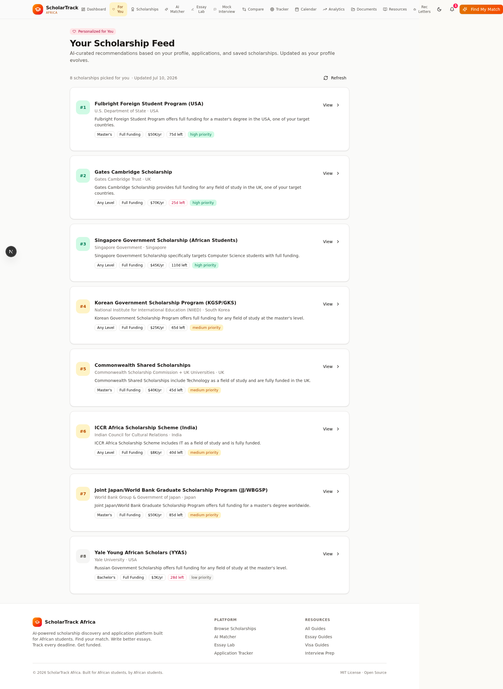

#### Smart Reminders & Alerts
Auto-generated deadline alerts (30d/14d/7d/3d/1d) with priority-coded cards. Bell icon in nav shows unread count.

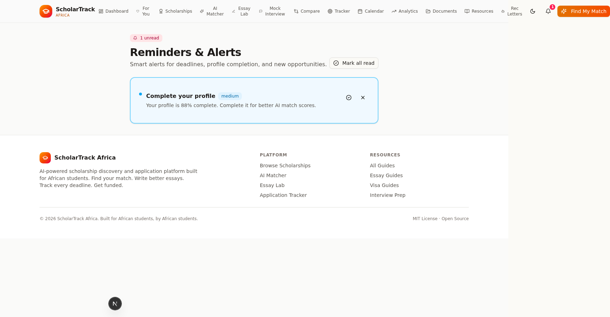

#### Application Checklist
Per-scholarship task list with 7 categories, progress bar, and quick-add buttons for common tasks.

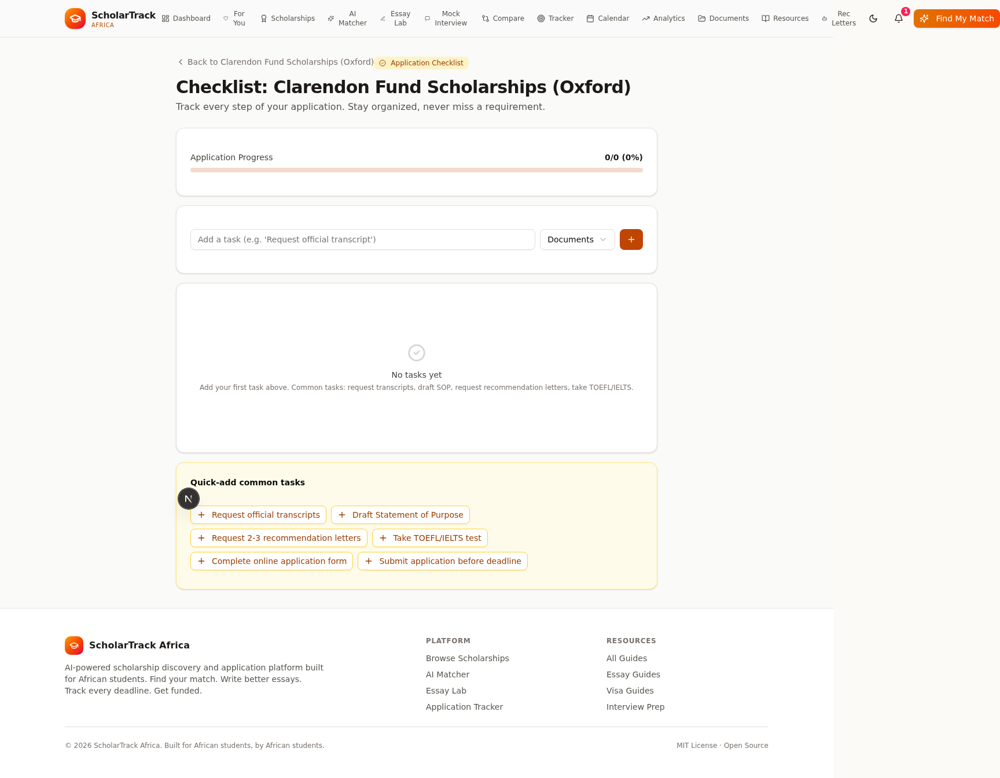

#### Checklist with Tasks
Tasks grouped by category (Documents, Essays, Tests, Recommendations, Forms, Submission). Click to toggle complete.

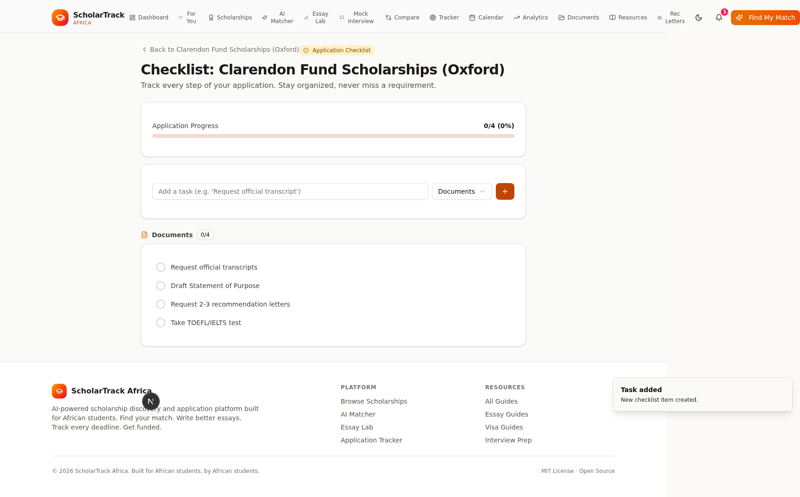

#### Browse — 51 Scholarships
The expanded database now has 51 verified scholarships.

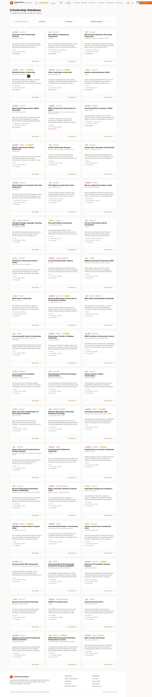

### v2 Screenshots

<details>
<summary><b>Click to expand v2 screenshots</b></summary>

#### Landing Page — Dark Mode
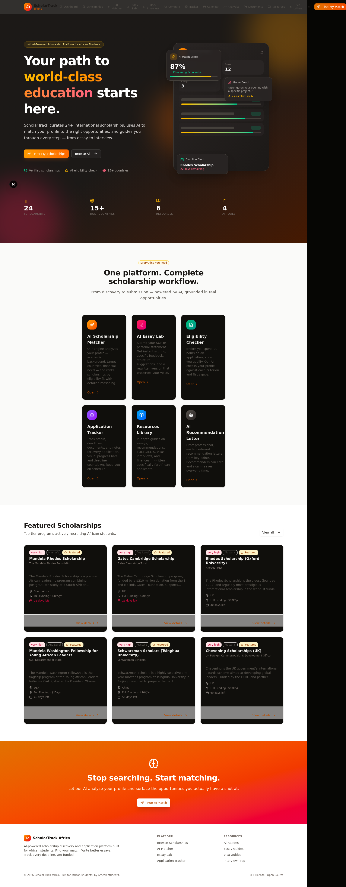

#### Dashboard — Dark Mode
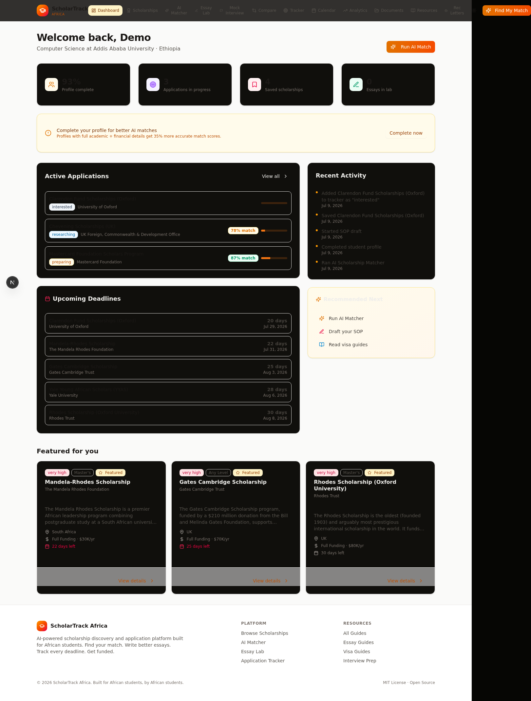

#### AI Mock Interview — In Progress
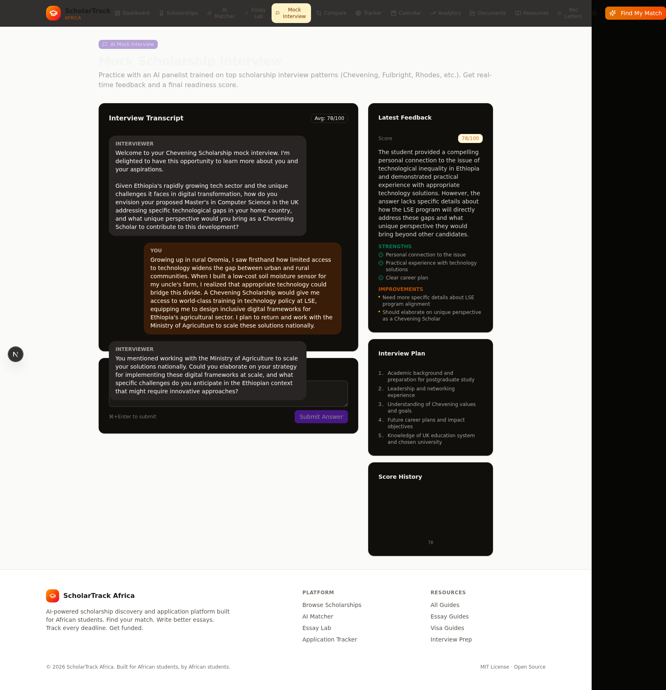

#### Scholarship Comparison
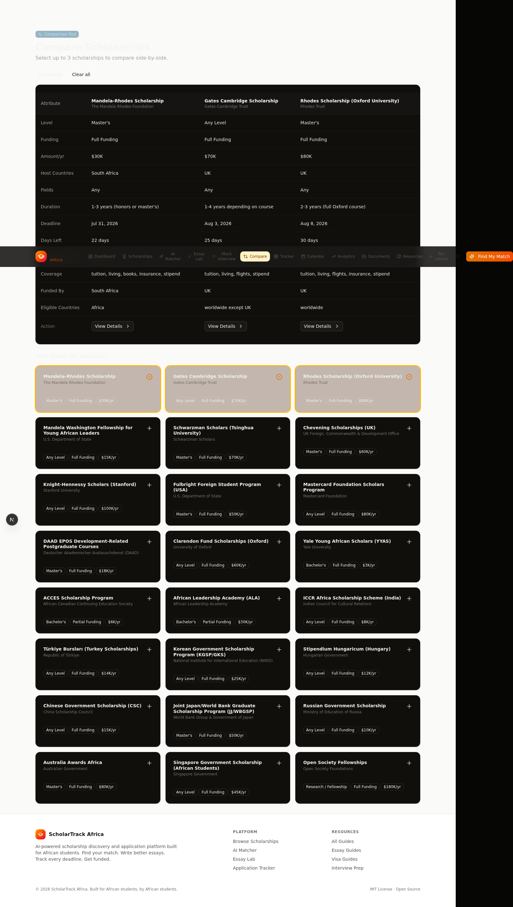

#### Deadline Calendar
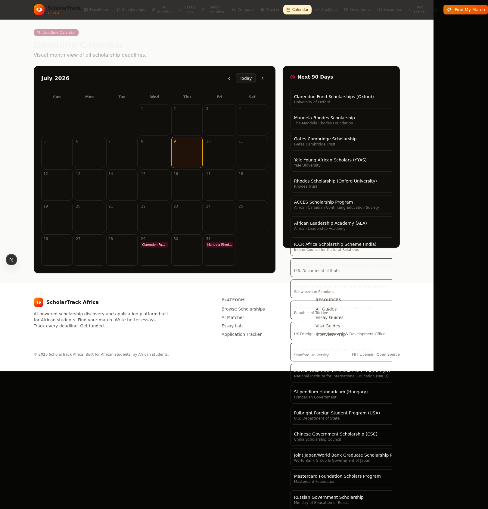

#### Analytics Dashboard
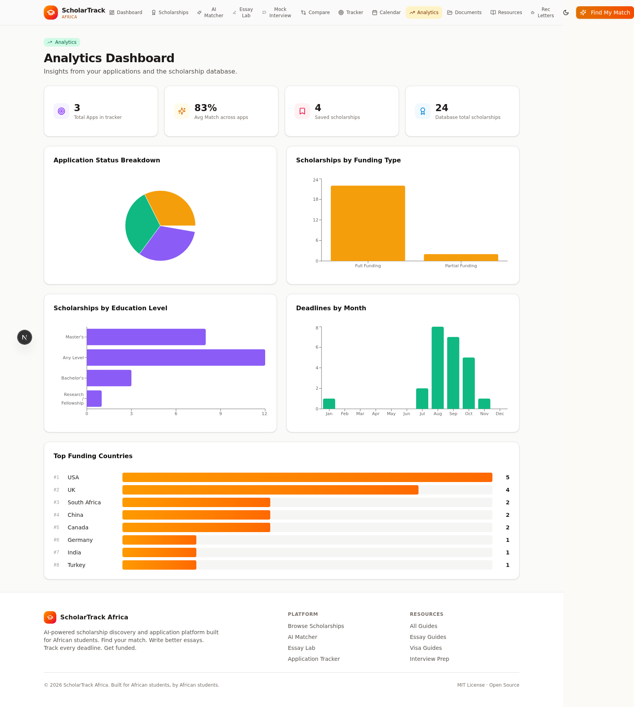

#### Profile Editor
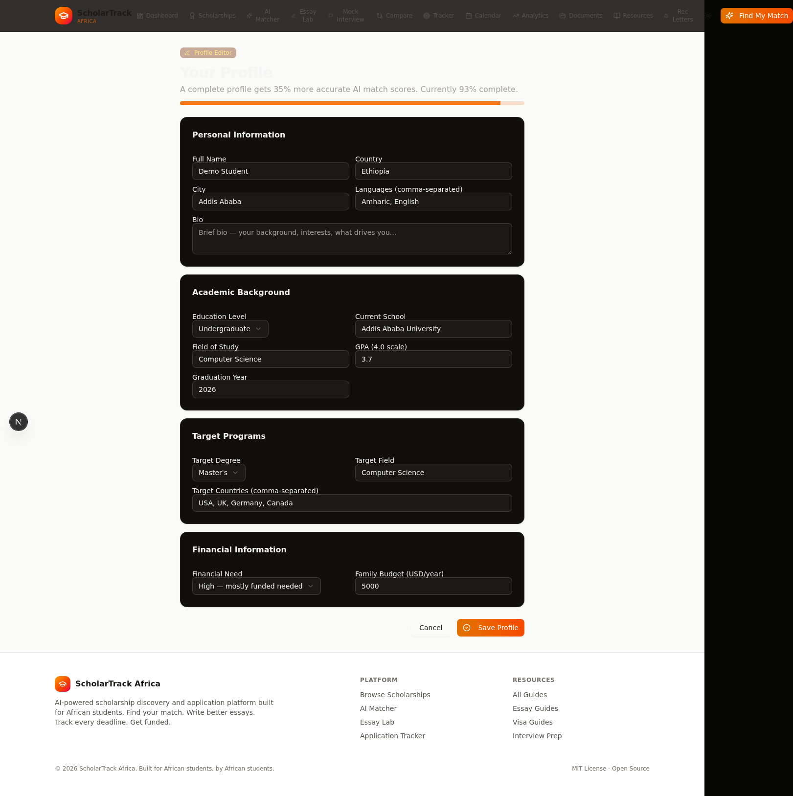

</details>

### v1 Screenshots

<details>
<summary><b>Click to expand v1 screenshots</b></summary>

#### Landing Page


#### Dashboard


#### Browse Scholarships


#### Scholarship Detail


#### AI Matcher Results


#### Essay Lab Results


#### Application Tracker


#### Resources Library


#### Eligibility Checker Results


</details>

---

## 🏗 Architecture

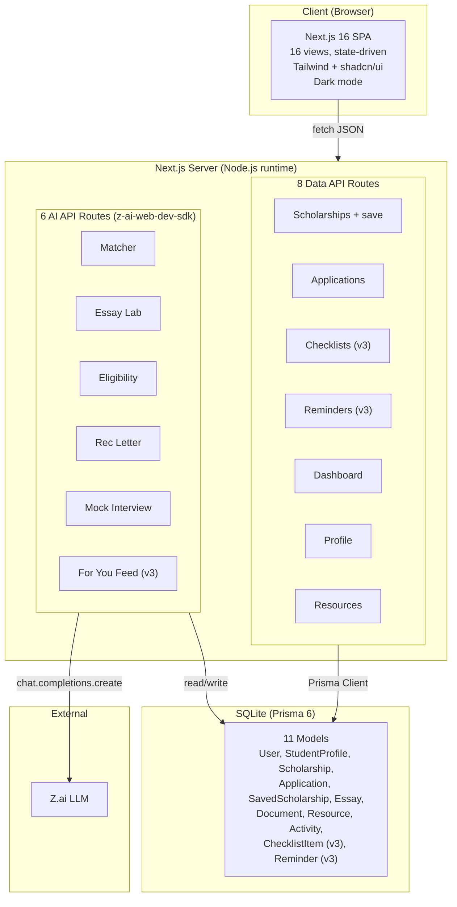

> 📐 Full Mermaid diagrams (ER, sequence flows, state machine) in [`docs/ARCHITECTURE.md`](docs/ARCHITECTURE.md)

---

## 🛠 Tech Stack

| Layer | Technology | Why |
|---|---|---|
| **Framework** | Next.js 16 (App Router, Turbopack) | Latest React 19, RSC, edge-ready |
| **Language** | TypeScript 5 (strict) | Type safety end-to-end |
| **Styling** | Tailwind CSS 4 + shadcn/ui (New York) | Utility-first, accessible components |
| **Database** | Prisma 6 ORM + SQLite | Type-safe queries, swappable to Postgres |
| **AI** | z-ai-web-dev-sdk | LLM for 6 AI features |
| **Animation** | Framer Motion 12 | View transitions, micro-interactions |
| **Charts** | Recharts | Analytics dashboard visualizations |
| **Theming** | next-themes | Dark mode with system preference detection |
| **Icons** | Lucide React | Consistent, tree-shakeable |
| **Validation** | Zod 4 | Runtime type checking on all API inputs |
| **PWA** | manifest.webmanifest | Installable web app |

---

## 🚀 Quick Start

### Prerequisites

- [Node.js](https://nodejs.org/) 18+ or [Bun](https://bun.sh/) (recommended)
- A `.env` file with:
  ```
  DATABASE_URL="file:./db/custom.db"
  ```

### Install & Run (4 commands)

```bash
bun install                      # 1. Install dependencies
bun run db:push                  # 2. Create database schema
bun run scripts/seed.ts          # 3. Seed 24 v1 scholarships + resources + demo user
bun run scripts/seed-v3.ts       # 4. Seed 27 additional v3 scholarships (51 total)
bun run dev                      # 5. Start dev server at http://localhost:3000
```

Open http://localhost:3000 — the app loads with a demo user already authenticated.

### Demo User

| Field | Value |
|---|---|
| Email | `demo@scholartrack.africa` |
| Country | Ethiopia |
| Field | Computer Science |
| GPA | 3.7 / 4.0 |
| Target | Master's in CS — USA, UK, Germany, Canada |

Pre-seeded with 2 applications, 3 saved scholarships, and activity feed.

---

## 🧠 AI Design

### Design Principles

1. **Server-side only** — All LLM calls happen in Next.js API routes. API keys never reach the browser.
2. **Structured JSON output** — Every AI route enforces a JSON schema via system prompt. We extract JSON (handles code-fenced or plain) and validate before returning.
3. **Graceful fallbacks** — If LLM returns malformed JSON, the matcher falls back to rule-based scoring. The feed falls back to simple ranking.
4. **Low temperature for analysis** — Analytical tasks use `temperature: 0.2-0.3`. Creative tasks (essay rewrite, rec letter) use `0.3-0.4`.
5. **Zod validation on input** — Every API route validates input with Zod before touching the LLM.

### AI Matcher — Scoring Rubric

| Criterion | Weight |
|---|---|
| Eligibility (country, age, degree) | 35% |
| Academic fit (field, GPA) | 25% |
| Target alignment (host country, degree) | 20% |
| Financial need / funding match | 10% |
| Language readiness | 5% |
| Competitiveness vs profile strength | 5% |

### Sample AI Output

<details>
<summary><b>Matcher result for demo profile (Ethiopian CS undergrad, GPA 3.7)</b></summary>

```json
{
  "matches": [
    {
      "scholarship": { "title": "Chevening Scholarships (UK)" },
      "score": 92,
      "reasons": [
        "Eligible from Ethiopia (African country)",
        "Targeting master's in Computer Science",
        "Strong GPA of 3.7 exceeds typical requirements",
        "Host country UK is in target countries list",
        "Full funding matches high financial need"
      ],
      "gaps": ["Requires at least 2 years work experience (not specified in profile)"],
      "recommendation": "Gain relevant work experience to meet the 2-year requirement."
    }
  ],
  "total": 12
}
```

</details>

---

## 🗄 Database

### 11 Prisma Models

| Model | Purpose | v3? |
|---|---|---|
| `User` | Auth + identity | |
| `StudentProfile` | Academic + financial profile (1:1 with User) | |
| `Scholarship` | 51 seeded entries | |
| `Application` | User ↔ Scholarship tracker | |
| `SavedScholarship` | Bookmarks | |
| `Essay` | AI Essay Lab drafts + cached feedback | |
| `Document` | Document vault entries | |
| `Resource` | 6 seeded guides | |
| `Activity` | Audit log / activity feed | |
| `ChecklistItem` | Per-scholarship task lists | ✅ v3 |
| `Reminder` | Deadline + profile alerts | ✅ v3 |

> 📐 Full ER diagram: [`docs/ARCHITECTURE.md`](docs/ARCHITECTURE.md#4-data-model-er-diagram)

---

## 🔌 API Reference

### AI Routes (6)

| Method | Endpoint | Purpose |
|---|---|---|
| `POST` | `/api/ai/match` | Score scholarships against student profile |
| `POST` | `/api/ai/essay` | Analyze essay draft + provide rewrite |
| `POST` | `/api/ai/eligibility` | Check eligibility for a specific scholarship |
| `POST` | `/api/ai/rec-letter` | Generate recommendation letter draft |
| `POST` | `/api/ai/interview` | Start/continue AI mock interview |
| `GET` | `/api/ai/feed` | Personalized "For You" recommendations (v3) |

### Data Routes (8)

| Method | Endpoint | Purpose |
|---|---|---|
| `GET` | `/api/scholarships` | List + filter (q, level, fundingType, country) |
| `GET` | `/api/scholarships/[id]` | Get by ID (increments view count) |
| `POST` | `/api/scholarships/[id]/save` | Toggle save/bookmark |
| `GET/POST/PATCH/DELETE` | `/api/checklists` | Application task lists (v3) |
| `GET/PATCH/DELETE` | `/api/reminders` | Smart deadline + profile alerts (v3) |
| `GET` | `/api/dashboard` | Aggregate dashboard data |
| `POST/PATCH` | `/api/applications` | Create/update applications |
| `PATCH` | `/api/profile` | Update student profile |

---

## 🎨 Design System

### Color Palette

African-inspired warm palette with full dark mode support:

| Token | Light | Dark | Usage |
|---|---|---|---|
| Background | `oklch(0.985 0.005 95)` | `oklch(0.12 0.005 95)` | Page background |
| Primary | Amber `#F59E0B` | Amber `#F59E0B` | Brand accent |
| Gradient | Amber → Orange → Rose | Same | CTAs, headers |
| Success | Emerald | Emerald | Pass, high match |
| Warning | Amber | Amber | Gaps, medium priority |
| Danger | Rose | Rose | Urgent, low match |

### Score Color Coding

| Score | Color | Meaning |
|---|---|---|
| 85-100 | Emerald | Excellent fit |
| 70-84 | Amber | Good fit |
| 50-69 | Orange | Moderate fit |
| 0-49 | Rose | Weak / ineligible |

### Accessibility

- Semantic HTML (`main`, `header`, `nav`, `section`, `article`)
- ARIA labels on all interactive elements
- Keyboard-navigable (Tab, Enter, Escape, ⌘+Enter in essay/interview)
- Touch targets ≥ 44px on mobile
- Color contrast meets WCAG AA

---

## ✅ Verification

All features verified end-to-end via Agent Browser:

| Feature | Status |
|---|---|
| Landing page (light + dark) | ✅ |
| Dashboard with 51 scholarships | ✅ |
| Browse with filters + sort | ✅ |
| Scholarship detail (save, tracker, checklist, eligibility) | ✅ |
| AI Matcher (12 matches in ~26s) | ✅ |
| AI Essay Lab (score + rewrite in ~12s) | ✅ |
| AI Eligibility Checker (verdict + criteria) | ✅ |
| AI Mock Interview (multi-turn + scoring) | ✅ |
| AI Rec Letter Drafter | ✅ |
| AI "For You" Feed (8 recommendations in ~20s) | ✅ v3 |
| Application Checklist (add/toggle/delete tasks) | ✅ v3 |
| Smart Reminders (auto-generated + bell badge) | ✅ v3 |
| Scholarship Comparison (3 side-by-side) | ✅ |
| Deadline Calendar (month grid) | ✅ |
| Analytics Dashboard (5 charts) | ✅ |
| Profile Editor (full CRUD) | ✅ |
| Dark mode toggle | ✅ |
| PWA manifest | ✅ |
| ESLint passes clean | ✅ |

---

## 🗺 Roadmap

### v1.0 (Shipped)
- 4 AI tools, 24 scholarships, application tracker, document vault, resources

### v2.0 (Shipped)
- Dark mode, AI Mock Interviewer, comparison tool, calendar, analytics, profile editor, PWA

### v3.0 (Current — Shipped)
- "For You" AI feed, application checklists, smart reminders, 51 scholarships total

### v3.1 (Next)
- Real authentication (NextAuth + GitHub/Google)
- Document upload (S3/Cloudflare R2)
- Email deadline reminders (cron)
- Voice-based mock interviews (TTS + ASR)
- Multi-language support (French, Portuguese, Arabic)

### v4.0 (Future)
- Postgres migration for production
- Deploy to Vercel
- Community features (forum, mentorship matching)
- Mobile app (React Native)
- Google Calendar sync

---

## 🤝 Contributing

This is a portfolio project, but issues and PRs are welcome.

1. Fork the repo
2. Create a feature branch (`git checkout -b feature/amazing-feature`)
3. Commit your changes (`git commit -m 'Add amazing feature'`)
4. Push to the branch (`git push origin feature/amazing-feature`)
5. Open a Pull Request

### Development

```bash
bun run dev          # Start dev server
bun run lint         # Run ESLint
bun run db:push      # Push schema changes
bun run db:generate  # Regenerate Prisma client
```

---

## 📄 License

MIT © 2025-2026 Hope0351

See [LICENSE](LICENSE) for the full text.

---

## 🙏 Acknowledgments

- **[Z.ai](https://chat.z.ai)** — `z-ai-web-dev-sdk` powers all AI features
- **[shadcn/ui](https://ui.shadcn.com)** — Accessible component library
- **[Prisma](https://prisma.io)** — Type-safe ORM
- **[Next.js](https://nextjs.org)** — React framework
- **[Recharts](https://recharts.org)** — Chart library
- **[next-themes](https://github.com/pacocoursey/next-themes)** — Dark mode
- Every African student who inspired this project

---

<div align="center">

**Built for African students, by African students.** 🌍

**[⬆ Back to top](#-scholartrack-africa)** · **[Download v3.0](https://github.com/Hope0351/scholartrack/releases/tag/v3.0.0)**

</div>
