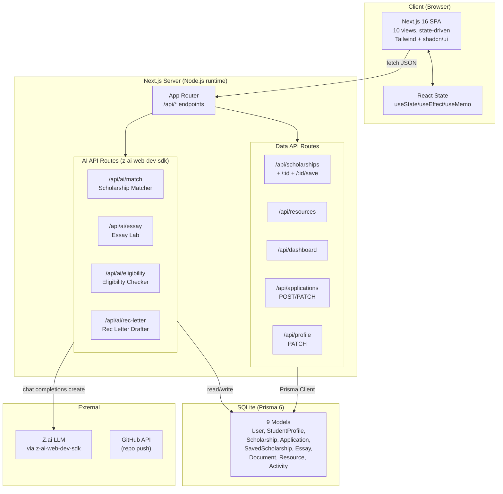
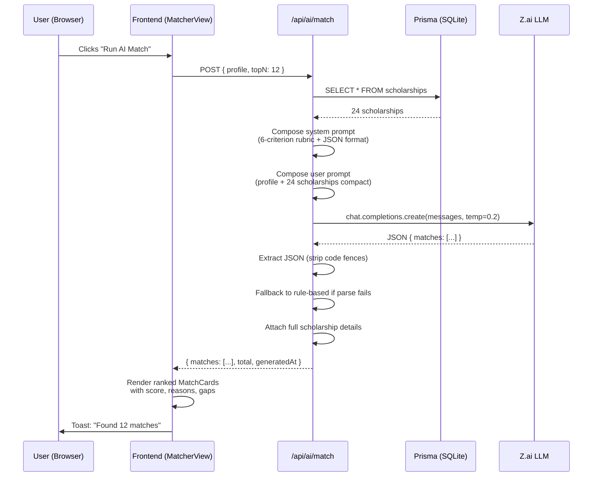
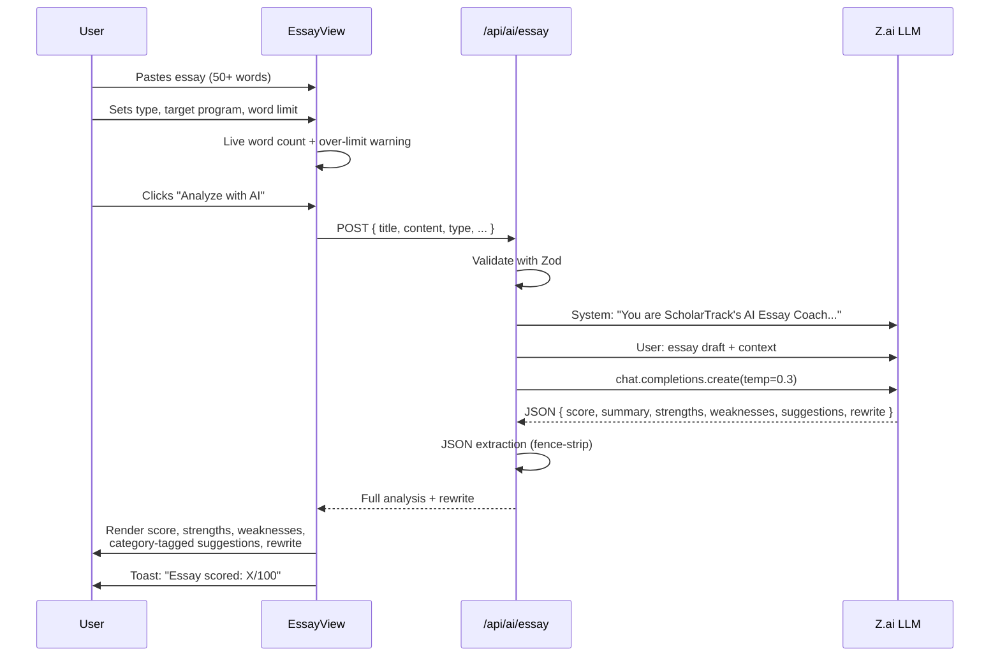
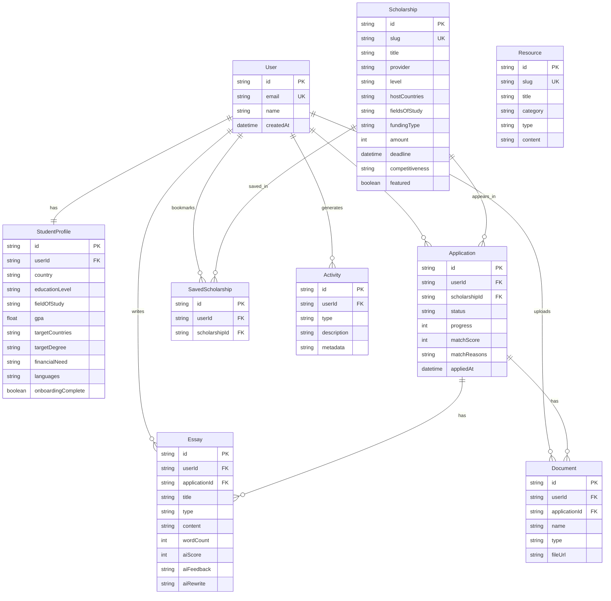
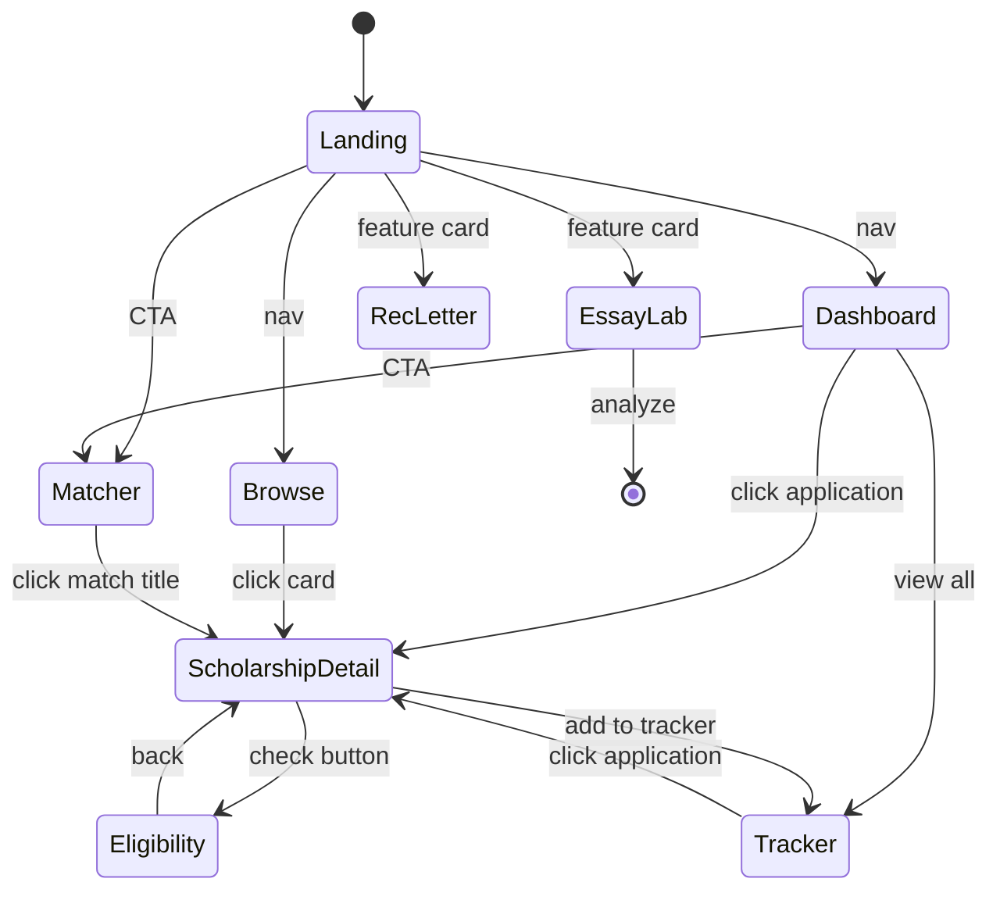
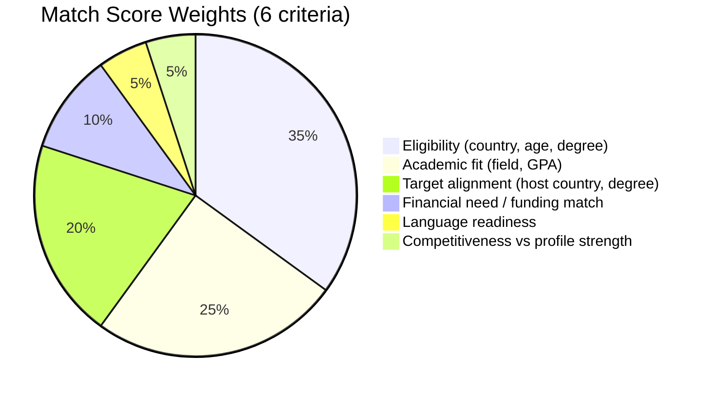

# ScholarTrack Architecture Diagrams

This file renders in any Mermaid viewer (GitHub, VS Code, mermaid.live).

## 1. High-Level System Architecture

## 2. AI Scholarship Matcher — Request Flow

## 3. Essay Lab — Analysis Flow

## 4. Data Model (ER Diagram)

## 5. View State Machine

## 6. AI Scoring Rubric (Matcher)

